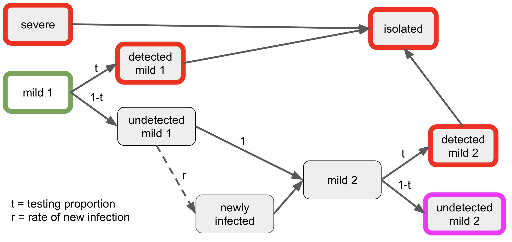

```{r setup, include=FALSE}
knitr::opts_chunk$set(echo = FALSE, message=FALSE, warning=FALSE)
```

The goal here is to develop some understanding of how testing (and subsequent isolation) reduces the disease burden on a population. This example is quite simplified, with only two time points and several assumptions. However, it might be a useful study in a situation where we look over a few days or weeks and suppose the severe cases are not changing in that time.
Simulation assumes all severe cases and some mild cases are detected by testing and immediately isolated.

Testing occurs at times 1 and 2, say a few days apart, with new cases being mild arising from the undetected mild cases. The plot shows the number of mild (**green**), mild + severe (**blue**) and confirmed (**red**) cases at time 2, and the number undetected (**magenta**) after testing at time 2. The initial number of mild cases (**olive**) is added for reference. 
This simulation considers a range of testing proportions with infection rate **`r reactive({input$rate})`**. We begin with **`r reactive({input$mild})`** mild cases per 100,000 and **`r reactive({input$severe})`** severe cases per 100,000. Each mild case undetected by test at time 1 will generate **`r reactive({input$rate})`** new mild cases. Thus, if there is no testing, there will be **`r reactive({input$mild * (1+input$rate)})`** mild cases (**green**) per 100,000 at time 2; undetected cases (**magenta**) decrease as a direct consequence of more testing and isolation at time 1. 
Notice the dramatic increase in confirmed cases (**red**) and reduction in undetected cases (**magenta**) when testing is at `50%` or more. More testing reveals more cases, which leads to isolation of those mild cases to reduce future infections. Use sliders to adjust key parameters.

```{r message=FALSE}
library(tidyverse)
```

```{r}
dat <- reactive({
  severe = input$severe
  initmild = input$mild
  rate = input$rate
  tibble(test = seq(0, 1, by = 0.1)) %>%
    mutate(mild = initmild + rate * initmild * (1 - test),
           confirmed = severe + 
             initmild * test + 
             (1 + rate) * initmild * (1 - test) * test,
           undetected = (1 + rate) * initmild * (1 - test) * (1 - test),
           initial_mild = initmild,
           mild_severe = mild + severe)})
```

```{r fig.width=10, fig.align="center", fig.cap="Consider a range of testing proportions."}
renderPlot({
  ggplot(
    mutate(
      pivot_longer(
        dat(),
        mild:mild_severe, names_to = "count", values_to = "value"))) +
  aes(test, value, col = count) +
  geom_line(size=2) +
  ylab("Disease Rate per 100000") +
  xlab("Proportion tested") +
  ggtitle(paste("Effect of Testing Proportion with Infection rate =", input$rate))
  })
```

```{r}
sliderInput("severe", "Severe cases per 100,000", 0, 100, 10)
sliderInput("mild", "Mild cases per 100,000", 0, 500, 100)
sliderInput("rate", "Infection rate", 0, 5, 0.5, step = 0.1)
```

## Simulation Logic

<center>

</center>

Assume that all $s$ severe cases are tested and isolated, and that a proportion $t$ of the population is tested by random sampling. Thus, a proportion $t$ of $m$ mild cases are confirmed by testing, and are then assumed to be isolated.
Assume also that $s$ and $m$ are small and that $s$ does not change during the time period considered. 
The proportion confirmed cases is then $c = s+mt$.

The advantage of detecting cases is to isolate them from the population to reduce infection.
Consider what happens from time 1 to time 2 with a rate $r$ of new mild infections from mild infected cases (and no new severe cases).
If severe cases are isolated and detected mild cases are also isolated, then only undetected mild cases can lead to new cases. That is, the proportion of mild cases at time 2 will be
$m_2 = (1+r) m_1(1-t_1)$,
of whom $(1+r) m_1(1-t_1)t_2$ will be detected at time 2 with testing proportion $t_2$.
Thus, the proportion of confirmed cases at time 2 will be
$c_2 = s + m_1t_1 + (1+r) m_1(1-t_1)t_2$.
The simulation above sets $t=t_1=t_2$.

